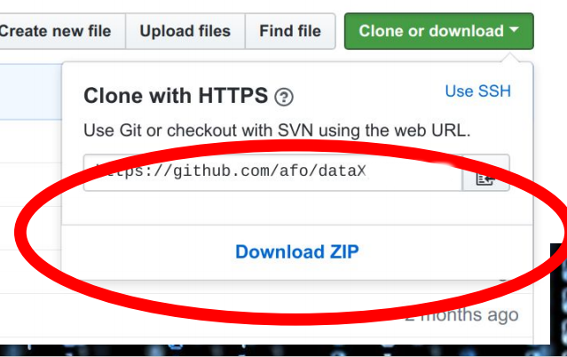

Data-X MBA
=======================

This is the official Github repository for the Program

## 📚 Resources

* ### [Data-X Official Website](https://data-x.blog/)
* ##### [Data-X Network](https://data-x.blog/advisors/)
* ##### [Data-X Resources](https://data-x.blog/resources/)
* ##### [Data-X Projects](https://data-x.blog/projects/)

### Download the Masterclass material

To download this Github repository just press the green `Clone or Download` button to the top right.

   

 

---

## Instructors / Organizers

<table style="table-layout: fixed; font-size: 88%;">
  <thead>
    <tr>
     <th style="width: 20%;"></th>
    </tr>
  </thead>
  <tbody>
    <tr>
     <td><a href="https://www.linkedin.com/in/alexanderfo">Alexander Fred-Ojala</a></td>
    </tr>
    <tr>
     <td>Research Director, <a href="http://scet.berkeley.edu/data-lab">SCET, Data Lab</a></td>
    </tr>
  </tbody>
</table>

## 📧 Contact 
 **Alexander Fred-Ojala:** afo @ berkeley edu ([LinkedIn](https://www.linkedin.com/in/alexanderfo/))

## 📁 About the Bootcamp

Today, the world is literally reinventing itself with Data, AI, and Blockchain technology.  However, neither leading companies nor the world’s top students have the complete knowledge set to participate in this newly developing world.  This course provides the tools and understanding to boost the participant's ability to implement and understand the emerging data applications of the future.  This bootcamp is suitable for individuals interested in understanding of emerging technologies and application opportunities in new ventures, industry project areas, and potential support of research with data technologies.

The bootcamp is a high paced immersion into data and data science principles in a uniquely practical business approach.  The program contains a real-life wide ranging project that can be started with guidance for instructors.

## 🎓 License

[Apache2](https://www.apache.org/licenses/LICENSE-2.0)

